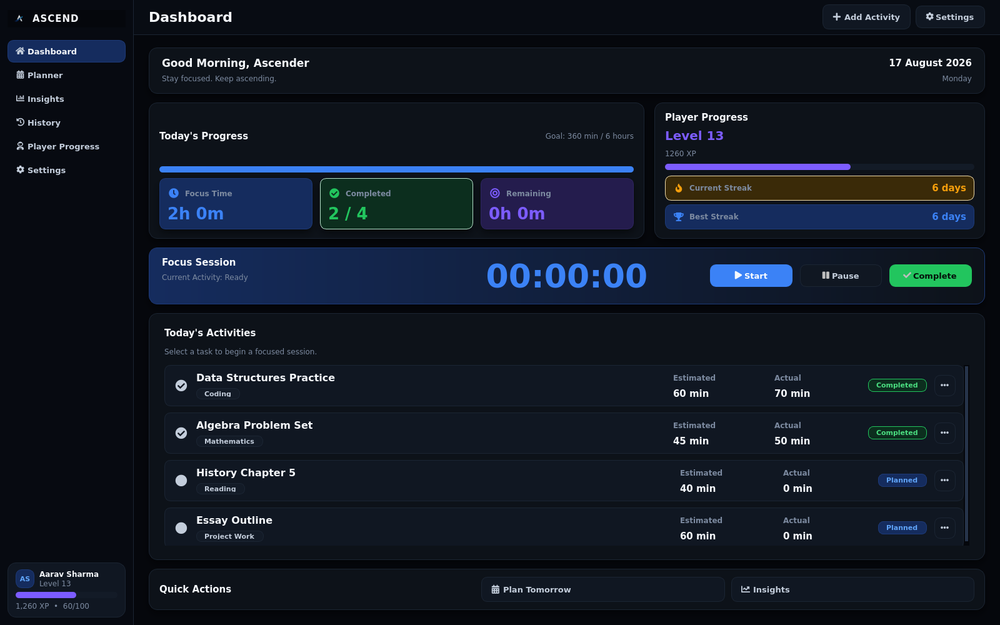
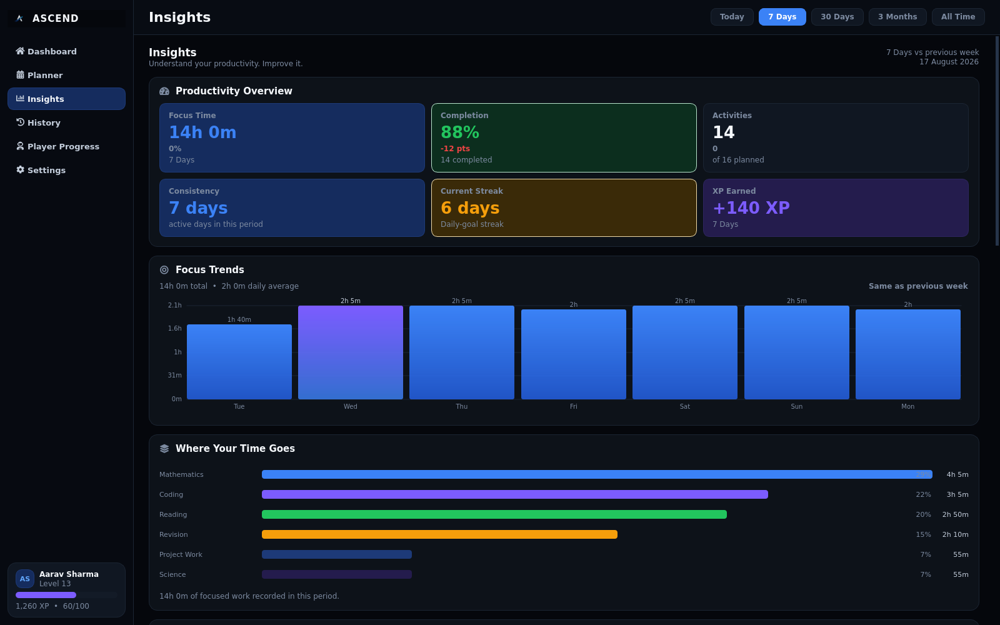
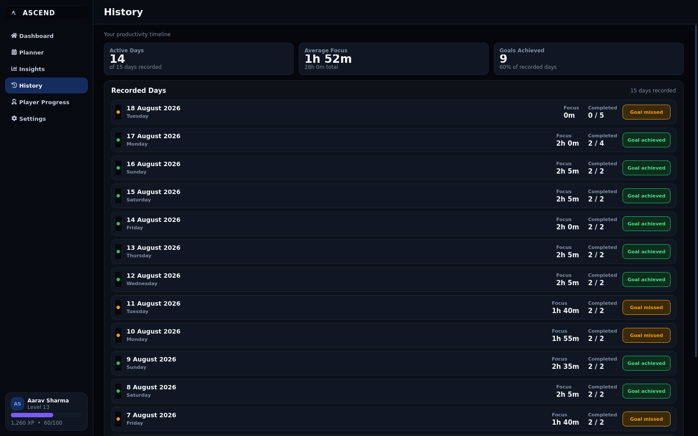

# Project Ascend

> **Your productivity, understood.**

Project Ascend is a local-first productivity desktop application designed to help you plan realistically, focus deeply, and understand how you actually work.

Built around a simple philosophy:

**ASSIST → UNDERSTAND → ADAPT**

Ascend doesn't try to control your day.  
It helps you understand it.

---

## ✨ What Ascend Does

### Plan Smarter

Ascend helps turn your available time and previous work into more realistic plans.

- **Tomorrow Planner**
- **Smart Estimates**
- **Capacity Intelligence**
- **Interactive Time Distribution**
- **Apply Changes**
- Persistent activities and planning

### Focus Better

Build focused work sessions and keep track of what you actually accomplish.

- Focus sessions
- Activity tracking
- Completion tracking
- Daily progress
- Player Progress

### Understand Yourself

Your activity history becomes useful information rather than just a collection of numbers.

- Productivity Insights
- Focus trends
- Time distribution
- Productivity rhythms
- Consistency tracking
- Historical productivity data
- Evidence-backed observations

---

# 🚀 What's New in v1.4

v1.4 is the first major production milestone of Project Ascend.

### Smart Estimates

Ascend uses your previous work data to make activity planning more realistic.

When there isn't enough historical evidence, Ascend avoids pretending that it knows more than it does.

### Capacity Intelligence

Tomorrow Planner considers the amount of time you actually have available and helps you understand whether your planned workload fits.

### Interactive Time Distribution

Experiment with how your available time should be distributed across activities before committing to the plan.

### Apply Changes

Make intentional time-allocation changes and apply them when you're satisfied with the plan.

### Insights

Understand your productivity through trends, time distribution, rhythms, consistency, and historical patterns.

### Refined UI

v1.4 also includes final visual polish across the application, including improved light-theme and sidebar presentation.

---

## 🖥️ Screenshots

### Dashboard

### Tomorrow Planner

### Capacity Intelligence

### Time Distribution

### Insights

### History

---

## 📥 Download

### Windows

Download the latest Windows installer from the GitHub Releases page.

**Project Ascend v1.4.0**

The Windows installer includes everything required to run Ascend.

You do **not** need Python, pip, Git, or a development environment.

---

## 🛠️ Built With

- **Python 3.13**
- **PySide6**
- **SQLite**
- **PyInstaller**
- **Inno Setup**
- **Git / GitHub**

Project Ascend is designed as a local-first application, keeping its productivity data on the user's computer.

---

## 🧭 Philosophy

### ASSIST → UNDERSTAND → ADAPT

**Assist**

Help you plan and organize your work without creating unnecessary friction.

**Understand**

Learn from your actual productivity history and surface useful patterns.

**Adapt**

Use what has been learned to make future planning more realistic.

The goal isn't to build a system that constantly tells you what to do.

The goal is to build a system that helps you make better decisions about your own time.

---

## 🗺️ What's Next?

### We're improving.

Project Ascend is still evolving.

Rather than adding features simply to make the version number bigger, future development will be guided by how people actually use Ascend.

Real feedback will shape what comes next.

**v1.5 will be informed by real-world usage and feedback.**

---

## 👤 About

Project Ascend is being built by **Shaurya Singh**, a student who wanted a productivity system that could do more than simply track time.

The project started from a simple question:

> *What if a productivity tool could actually understand how I work?*

Ascend is an attempt to explore that idea — starting as a personal tool and gradually becoming something that other students can use too.

The long-term aspiration is to build technology that doesn't simply give people more information, but helps them understand themselves and make better decisions.

---

## 🌱 Development

Project Ascend is developed openly on GitHub.

The project is currently focused on real-world usage, feedback, and continuous improvement.

**Source code and development:**  
GitHub — [Project Ascend](https://github.com/shauryasingh4028s-eng/ProjectAscend)

---

## 💬 Feedback

Using Ascend?

I'd genuinely like to know what you think.

Tell me:

- What worked well?
- What felt confusing?
- What would you change?
- What would make you use Ascend regularly?

Your feedback will help shape future versions of the project.

**Feedback form:** Coming soon.

---

## 📄 License

See the repository for the current licensing information.